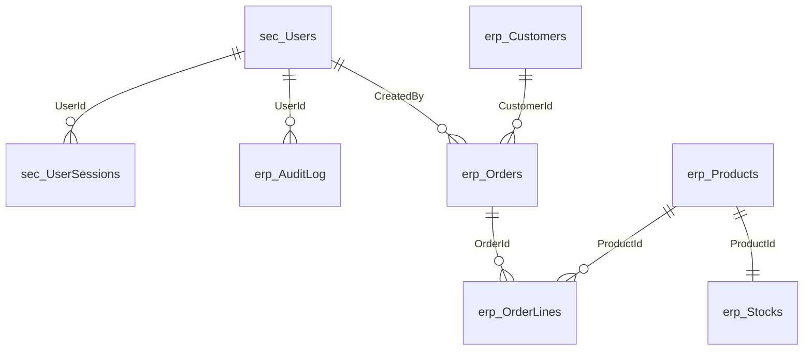

# Arquitectura de Base de Datos - Sistema ERP Módulo de Pedidos

## Información General

- **Proyecto**: Ofima.Project.AiTestV1
- **Módulo**: Gestión de Pedidos ERP
- **Base de Datos**: OfimaPedidosERP
- **Motor**: Microsoft SQL Server
- **Fecha de Creación**: 2025-10-21
- **Versión**: 1.0

## Objetivo

Diseñar e implementar la estructura de base de datos para el módulo de gestión de pedidos de un sistema ERP, que permita digitalizar el proceso de registro de pedidos con control automático de inventario, auditoría completa y soporte para integración con sistemas legados (Visual FoxPro) y modernos (.NET).

## Arquitectura General

### Esquemas de Base de Datos

La base de datos está organizada en dos esquemas principales:

1. **`sec` (Seguridad)**: Manejo de usuarios, autenticación y sesiones
2. **`erp` (Enterprise Resource Planning)**: Lógica de negocio del módulo de pedidos

## Modelo de Datos

### Esquema `sec` - Seguridad

#### Tabla: `sec.Users`
**Propósito**: Almacenar usuarios del sistema con información de autenticación.

| Campo | Tipo | Descripción | Restricciones |
|-------|------|-------------|---------------|
| Id | INT IDENTITY | Identificador único del usuario | PK, Auto-increment |
| Username | NVARCHAR(80) | Nombre de usuario único | UNIQUE, NOT NULL, >= 3 caracteres |
| PasswordHash | VARBINARY(256) | Hash de la contraseña | NOT NULL |
| Role | NVARCHAR(40) | Rol del usuario | DEFAULT 'User', CHECK (Admin, Manager, User, Viewer) |
| IsActive | BIT | Estado activo del usuario | DEFAULT 1 |
| CreatedAt | DATETIME2(7) | Fecha de creación | DEFAULT SYSUTCDATETIME() |
| UpdatedAt | DATETIME2(7) | Fecha de última actualización | NULL |
| LastLoginAt | DATETIME2(7) | Fecha de último acceso | NULL |

**Índices**:
- `IX_Users_IsActive`: Optimiza consultas por estado activo
- `IX_Users_Role`: Optimiza consultas por rol
- `IX_Users_CreatedAt`: Optimiza consultas por fecha de creación

#### Tabla: `sec.UserSessions`
**Propósito**: Registro de sesiones activas para auditoría y control de tokens JWT.

| Campo | Tipo | Descripción | Restricciones |
|-------|------|-------------|---------------|
| Id | BIGINT IDENTITY | Identificador único de sesión | PK, Auto-increment |
| UserId | INT | Referencia al usuario | FK a sec.Users(Id), NOT NULL |
| TokenId | NVARCHAR(100) | Identificador único del token JWT | UNIQUE, NOT NULL |
| CreatedAt | DATETIME2(7) | Fecha de creación de sesión | DEFAULT SYSUTCDATETIME() |
| ExpiresAt | DATETIME2(7) | Fecha de expiración | NOT NULL |
| IsRevoked | BIT | Estado de revocación | DEFAULT 0 |
| RevokedAt | DATETIME2(7) | Fecha de revocación | NULL |
| IpAddress | NVARCHAR(45) | Dirección IP del cliente | NULL |
| UserAgent | NVARCHAR(500) | Información del navegador/cliente | NULL |

### Esquema `erp` - Lógica de Negocio

#### Tabla: `erp.Customers`
**Propósito**: Almacenar información de clientes del sistema.

| Campo | Tipo | Descripción | Restricciones |
|-------|------|-------------|---------------|
| Id | INT IDENTITY | Identificador único del cliente | PK, Auto-increment |
| Name | NVARCHAR(120) | Nombre o razón social | NOT NULL, >= 2 caracteres |
| TaxId | NVARCHAR(32) | Número de identificación tributaria | UNIQUE, NOT NULL, >= 5 caracteres |
| Email | NVARCHAR(100) | Correo electrónico | NULL |
| Phone | NVARCHAR(20) | Teléfono de contacto | NULL |
| Address | NVARCHAR(200) | Dirección física | NULL |
| IsActive | BIT | Estado activo del cliente | DEFAULT 1 |
| CreatedAt | DATETIME2(7) | Fecha de creación | DEFAULT SYSUTCDATETIME() |
| UpdatedAt | DATETIME2(7) | Fecha de última actualización | NULL |

#### Tabla: `erp.Products`
**Propósito**: Catálogo de productos disponibles para venta.

| Campo | Tipo | Descripción | Restricciones |
|-------|------|-------------|---------------|
| Id | INT IDENTITY | Identificador único del producto | PK, Auto-increment |
| Sku | NVARCHAR(40) | Código único del producto | UNIQUE, NOT NULL, >= 3 caracteres |
| Name | NVARCHAR(120) | Nombre del producto | NOT NULL, >= 2 caracteres |
| Description | NVARCHAR(500) | Descripción detallada | NULL |
| Price | DECIMAL(18,2) | Precio unitario | NOT NULL, >= 0 |
| IsActive | BIT | Estado activo del producto | DEFAULT 1 |
| CreatedAt | DATETIME2(7) | Fecha de creación | DEFAULT SYSUTCDATETIME() |
| UpdatedAt | DATETIME2(7) | Fecha de última actualización | NULL |

#### Tabla: `erp.Stocks`
**Propósito**: Control de inventario por producto con manejo de stock disponible y reservado.

| Campo | Tipo | Descripción | Restricciones |
|-------|------|-------------|---------------|
| ProductId | INT | Referencia al producto | PK, FK a erp.Products(Id) |
| OnHand | INT | Cantidad física en inventario | NOT NULL, >= 0 |
| Reserved | INT | Cantidad reservada por pedidos confirmados | NOT NULL, >= 0, <= OnHand |
| Available | INT | Cantidad disponible (calculada) | AS (OnHand - Reserved) PERSISTED |
| LastUpdatedAt | DATETIME2(7) | Fecha de última actualización | DEFAULT SYSUTCDATETIME() |
| RowVersion | ROWVERSION | Control de concurrencia optimista | NOT NULL |

#### Tabla: `erp.Orders`
**Propósito**: Pedidos del sistema con control de estados y totales.

| Campo | Tipo | Descripción | Restricciones |
|-------|------|-------------|---------------|
| Id | INT IDENTITY | Identificador único del pedido | PK, Auto-increment |
| Number | NVARCHAR(30) | Número único del pedido | UNIQUE, NOT NULL |
| CustomerId | INT | Referencia al cliente | FK a erp.Customers(Id), NOT NULL |
| Status | TINYINT | Estado del pedido | NOT NULL, CHECK (0,1,2) |
| SubTotal | DECIMAL(18,2) | Subtotal antes de impuestos | NOT NULL, >= 0 |
| TaxAmount | DECIMAL(18,2) | Monto de impuestos | NOT NULL, >= 0 |
| Total | DECIMAL(18,2) | Total del pedido | NOT NULL, >= 0 |
| CreatedAt | DATETIME2(7) | Fecha de creación | DEFAULT SYSUTCDATETIME() |
| ConfirmedAt | DATETIME2(7) | Fecha de confirmación | NULL |
| CanceledAt | DATETIME2(7) | Fecha de anulación | NULL |
| CreatedBy | INT | Usuario que creó el pedido | FK a sec.Users(Id), NOT NULL |
| Notes | NVARCHAR(500) | Notas adicionales | NULL |
| RowVersion | ROWVERSION | Control de concurrencia optimista | NOT NULL |

**Estados del Pedido**:
- `0`: Nuevo - Pedido creado, puede ser editado
- `1`: Confirmado - Pedido confirmado, stock reservado
- `2`: Anulado - Pedido cancelado, stock liberado

#### Tabla: `erp.OrderLines`
**Propósito**: Líneas de detalle de los pedidos con productos y cantidades.

| Campo | Tipo | Descripción | Restricciones |
|-------|------|-------------|---------------|
| Id | INT IDENTITY | Identificador único de la línea | PK, Auto-increment |
| OrderId | INT | Referencia al pedido | FK a erp.Orders(Id), NOT NULL |
| ProductId | INT | Referencia al producto | FK a erp.Products(Id), NOT NULL |
| Qty | INT | Cantidad solicitada | NOT NULL, > 0 |
| UnitPrice | DECIMAL(18,2) | Precio unitario al momento del pedido | NOT NULL, >= 0 |
| LineTotal | DECIMAL(18,2) | Total de la línea (calculado) | AS (Qty * UnitPrice) PERSISTED |
| CreatedAt | DATETIME2(7) | Fecha de creación | DEFAULT SYSUTCDATETIME() |

**Restricción Única**: Un producto solo puede aparecer una vez por pedido (`UQ_OrderLines_OrderId_ProductId`)

#### Tabla: `erp.AuditLog`
**Propósito**: Registro de auditoría para trazabilidad completa de operaciones.

| Campo | Tipo | Descripción | Restricciones |
|-------|------|-------------|---------------|
| Id | BIGINT IDENTITY | Identificador único del registro | PK, Auto-increment |
| UserId | INT | Usuario que ejecutó la acción | FK a sec.Users(Id), NOT NULL |
| Entity | NVARCHAR(40) | Entidad afectada | NOT NULL |
| EntityId | INT | ID de la entidad afectada | NOT NULL |
| Action | NVARCHAR(30) | Acción ejecutada | CHECK (CREATE, UPDATE, DELETE, CONFIRM, CANCEL, LOGIN, LOGOUT) |
| At | DATETIME2(7) | Fecha y hora de la acción | DEFAULT SYSUTCDATETIME() |
| Payload | NVARCHAR(MAX) | Datos adicionales en JSON | NULL |
| IpAddress | NVARCHAR(45) | Dirección IP del cliente | NULL |
| UserAgent | NVARCHAR(500) | Información del cliente | NULL |

## Relaciones y Integridad Referencial

### Relaciones Principales



### Reglas de Integridad

1. **Eliminación Restrictiva**: 
   - No se pueden eliminar clientes con pedidos asociados
   - No se pueden eliminar productos con líneas de pedido asociadas
   - No se pueden eliminar usuarios que hayan creado pedidos

2. **Eliminación en Cascada**:
   - Al eliminar un pedido, se eliminan automáticamente sus líneas
   - Al eliminar un producto, se elimina automáticamente su registro de stock
   - Al eliminar un usuario, se eliminan sus sesiones

3. **Control de Concurrencia**:
   - Tablas `Orders` y `Stocks` incluyen `RowVersion` para concurrencia optimista
   - Previene conflictos en operaciones simultáneas de confirmación/anulación

## Índices y Optimización

### Índices Principales

**Esquema `sec`**:
- `IX_Users_IsActive`: Consultas de usuarios activos
- `IX_Users_Role`: Filtrado por roles
- `IX_UserSessions_UserId`: Sesiones por usuario
- `IX_UserSessions_ExpiresAt`: Limpieza de sesiones expiradas

**Esquema `erp`**:
- `IX_Customers_IsActive`: Clientes activos para pedidos
- `IX_Products_IsActive`: Productos disponibles
- `IX_Orders_CustomerId`: Pedidos por cliente
- `IX_Orders_Status`: Filtrado por estado de pedido
- `IX_Orders_CreatedAt`: Ordenamiento cronológico
- `IX_OrderLines_OrderId`: Líneas por pedido
- `IX_Stocks_Available`: Stock disponible para reservas
- `IX_AuditLog_Entity`: Auditoría por entidad

## Reglas de Negocio Implementadas

### Control de Stock

1. **Reserva Automática**: Al confirmar un pedido, se reserva automáticamente el stock
2. **Validación de Disponibilidad**: Solo se puede confirmar si hay stock suficiente
3. **Liberación de Stock**: Al anular un pedido confirmado, se libera el stock reservado
4. **Integridad de Stock**: `Reserved` nunca puede ser mayor que `OnHand`

### Estados de Pedido

1. **Flujo Controlado**: Nuevo → Confirmado → (Anulado opcional)
2. **Edición Restringida**: Solo pedidos en estado "Nuevo" pueden ser editados
3. **Confirmación Única**: Un pedido solo puede ser confirmado una vez
4. **Anulación Controlada**: Solo pedidos "Confirmados" pueden ser anulados

### Auditoría Completa

1. **Trazabilidad**: Todas las operaciones críticas se registran en `AuditLog`
2. **Usuario Responsable**: Cada acción se asocia a un usuario específico
3. **Timestamp Preciso**: Registro con precisión de microsegundos
4. **Payload Flexible**: Información adicional en formato JSON

## Datos Semilla

### Usuarios de Prueba

| Username | Role | Password | Estado |
|----------|------|----------|--------|
| admin | Admin | 123456 | Activo |
| manager | Manager | 123456 | Activo |
| vendedor1 | User | 123456 | Activo |
| vendedor2 | User | 123456 | Activo |
| viewer | Viewer | 123456 | Activo |

### Datos de Ejemplo

- **6 Clientes**: Incluyendo distribuidoras y comercializadoras
- **10 Productos**: Equipos de tecnología con diferentes precios
- **4 Pedidos**: En diferentes estados (Nuevo, Confirmado, Anulado)
- **Stock Inicial**: Cantidades variadas por producto
- **Auditoría**: Registros de creación y cambios de estado

## Scripts de Implementación

### Orden de Ejecución

1. `01_CreateDatabase.sql` - Creación de BD y esquemas
2. `02_CreateSecurityTables.sql` - Tablas de seguridad
3. `03_CreateERPTables.sql` - Tablas de lógica de negocio
4. `04_SeedData.sql` - Datos iniciales y de prueba
5. `00_ExecuteAll.sql` - Script maestro (ejecuta todos en orden)

### Comandos de Ejecución

```sql
-- Opción 1: Script maestro
sqlcmd -S localhost -d master -i "00_ExecuteAll.sql"

-- Opción 2: Scripts individuales
sqlcmd -S localhost -d master -i "01_CreateDatabase.sql"
sqlcmd -S localhost -d OfimaPedidosERP -i "02_CreateSecurityTables.sql"
sqlcmd -S localhost -d OfimaPedidosERP -i "03_CreateERPTables.sql"
sqlcmd -S localhost -d OfimaPedidosERP -i "04_SeedData.sql"
```

## Consideraciones de Seguridad

1. **Hashing de Contraseñas**: Las contraseñas se almacenan hasheadas con SHA256
2. **Roles Definidos**: Sistema de roles para control de acceso
3. **Auditoría Completa**: Registro de todas las operaciones críticas
4. **Sesiones Controladas**: Tracking de sesiones JWT para revocación
5. **Integridad Referencial**: Restricciones FK para consistencia de datos

## Escalabilidad y Mantenimiento

### Optimizaciones Implementadas

1. **Índices Estratégicos**: Cobertura de consultas frecuentes
2. **Campos Calculados**: `Available` en Stock, `LineTotal` en OrderLines
3. **Particionado Futuro**: Estructura preparada para particionado por fecha
4. **Compresión**: Tipos de datos optimizados para reducir espacio

### Monitoreo Recomendado

1. **Fragmentación de Índices**: Mantenimiento periódico
2. **Estadísticas**: Actualización automática habilitada
3. **Crecimiento de AuditLog**: Implementar archivado periódico
4. **Deadlocks**: Monitoreo en operaciones de stock concurrentes

## Integración con Aplicaciones

### API .NET Core
- Mapeo directo con Entity Framework Core
- DTOs para transferencia de datos
- Validaciones en capa de aplicación

### Cliente Visual FoxPro
- Consumo via HTTP/JSON
- Validaciones locales complementarias
- Manejo de errores específicos

### Reportería
- Vistas preparadas para consultas complejas
- Índices optimizados para agregaciones
- Estructura normalizada para joins eficientes

---

**Documento generado el**: 2025-10-21  
**Versión**: 1.0  
**Autor**: Sistema de IA - Proyecto Ofima ERP
